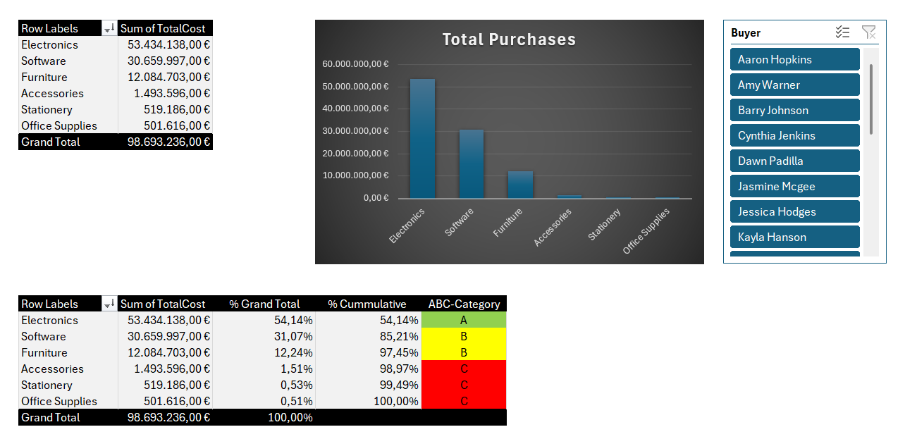

# Spend Analysis & Strategic Procurement Dashboard (Excel)

##  Overview
This project delivers an interactive Spend Analysis Dashboard created in Microsoft Excel based on transaction-level procurement data (~2.02M € total spend). The objective is to identify spend concentrations, automate ABC classification, and derive actionable insights for strategic purchasing and supplier risk management.

---

##  Key Features
* **Dynamic Pivot Analysis:** Aggregated total spend across product categories, suppliers, and individual buyers.
* **Automated ABC Classification:** Implemented nested logic formulas (`IF`) based on cumulative spend percentage thresholds (A: ≤ 70%, B: ≤ 98%, C: > 98%).
* **Pareto Chart Visualization:** Visualized spend distribution and cumulative impact to highlight high-priority categories.
* **Interactive Slicer:** Embedded a `Buyer` slicer to dynamically filter all dashboard components in real time.

---

##  Key Findings & Strategic Insights

| Category | Spend (€) | Share (%) | ABC Class | Strategic Recommendation |
| :--- | :--- | :--- | :--- | :--- |
| **Electronics** | 53.434.138 € | 54,14 % | **A** | High-value priority: Dual-sourcing assessment to mitigate high supplier concentration risks. |
| **Software** | 30.659.997 € | 31,07 % | **B** | Strategic sourcing: Conduct contract & license model reviews for cost reduction. |
| **Furniture** | 12.084.703 € | 12,24 % | **B** | Strategic sourcing: Evaluate supplier performance and negotiate volume terms. |
| **Accessories** | 1.493.596 € | 1,51 % | **C** | Process optimization: Implement standard catalog purchasing to reduce manual efforts. |
| **Stationery** | 519.186 € | 0,53 % | **C** | Process optimization: Consolidate small orders via framework agreements. |
| **Office Supplies** | 501.616 € | 0,51 % | **C** | Automated ordering / E-procurement to minimize administrative costs. |

> **Supplier Risk Note:** Over **98% of total procurement spend** is concentrated among just three main suppliers (*QuickDeliver*, *TechMart*, *FurniWorks*), indicating high dependency and a need for risk mitigation strategies.

---

##  Tech Stack & Tools Used
* **Tool:** Microsoft Excel (PivotTables, Advanced Formulas, Slicers, Pareto Charts)
* **Methodologies:** Spend Analysis, ABC Categorization, Pareto Principle (80/20 Rule), Strategic Sourcing Frameworks

---

##  How to Use
1. Clone or download this repository.
2. Open `dashboard/Spend_Analysis_Dashboard.xlsx`.
3. Use the **Buyer Slicer** on the right side of the sheet to filter spend dynamically across team members.
